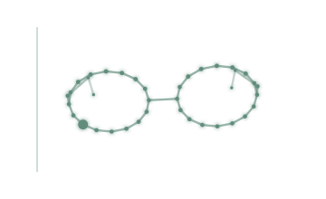

 

## 🧠 About me

<table>
<tr>
<td width="62%" valign="top">

I'm an **AI Engineer at Syra (formerly Zedny)** and a Computer Vision / NLP / Deep Learning specialist based in Cairo, Egypt. I graduated in Artificial Intelligence Technology from **Helwan International Technological University (HITU)** with a **3.7 / 4.0 GPA**, and I like to own the whole pipeline: collecting data, training the model, shipping it behind a FastAPI backend and putting a React interface on top.

- 👓 Led **PATHIRA VISION** — AI smart glasses for the visually impaired (graduation project, graded **A+**)
- 📄 Co-authored & presented a paper on it at **IUGRC-10**, Military Technical College, Cairo (July 2026)
- 🏆 Winner at **NASA Space Apps**, **DEPI (Microsoft ML track)** and **AppX**
- 💼 Freelance ML developer since 2023 — **10+ international projects, 95%+ client satisfaction**
- 🚀 Contributed CV modules to a corporate wellness platform that is **live at Aramco**
- 🌱 Interested in robotics, space tech, open source and AI for social good

</td>
<td width="38%" align="center" valign="middle">

</td>
</tr>
</table>

 

## 🎮 Play Tic-Tac-Toe against my Minimax AI

Yes, this board is real and it runs from my profile. Every click opens a pre-filled GitHub issue, a GitHub Action plays the AI's turn with a **minimax** search over the full game tree, and the board below gets rewritten. I gave the AI a 12% chance to blunder so you actually stand a chance. 😉

<!-- TTT:START -->

It's your move — you are <b>X</b>, the AI is <b>O</b>. Click any empty cell to play. Anyone can join the current game!

<table align="center">
<tr><td align="center"></td><td align="center"></td><td align="center"></td></tr>
<tr><td align="center"></td><td align="center"></td><td align="center"></td></tr>
<tr><td align="center"></td><td align="center"></td><td align="center"></td></tr>
</table>

🏆 <b>Beat the AI:</b> nobody yet — be the first! 🎮 <b>Recent players:</b> nobody yet Stuck or want a clean board? <a href="https://github.com/YOUR_USERNAME/YOUR_USERNAME/issues/new?title=ttt%7Cnew&body=Just+click+%22Submit+new+issue%22+to+start+a+fresh+game.">Start a new game</a> · Moves take ~30 seconds to show up (a GitHub Action plays the AI's turn).

<!-- TTT:END -->

<b>How does the AI decide its move?</b>

 

Minimax scores every reachable position from the AI's point of view (**+1** win, **0** draw, **−1** loss) and assumes you always play your best reply. Tic-tac-toe is small enough (5,478 legal positions) that the whole tree is searched on every move, so the AI never loses — unless one of its deliberate 12% "human moments" kicks in. The engine lives in [`game/tictactoe.py`](game/tictactoe.py), the automation in [`.github/workflows/tictactoe.yml`](.github/workflows/tictactoe.yml).

 

## 🚀 Featured projects

<table>
<tr>
<td width="50%" valign="top">

<h3 align="center">👓 PATHIRA VISION</h3>

AI-powered smart glasses that help visually impaired users navigate independently: real-time obstacle detection, face recognition for familiar people, OCR for printed **and handwritten** text, scene understanding, navigation assistance and hands-free voice commands, all fused by a decision engine into audio and haptic feedback. Graduation project at HITU (A+), published at IUGRC-10.

    

</td>
<td width="50%" valign="top">

<h3 align="center">🎬 AI Video Content Generator</h3>

Turns an infographic image or a plain text script into a narrated, progressively revealed explainer video. Computer-vision layout analysis and segmentation decompose the source into visual elements, OCR handles Arabic and English, and text-to-speech narrates it. Backend on Python, FastAPI and Supabase for orchestration, storage and data.

    

<h3 align="center">🍳 Kitchen Hygiene Monitor · DEPI</h3>

Real-time YOLOv8 pipeline that detects PPE compliance (masks, gloves) and hygiene violations in industrial kitchens, with a live FastAPI dashboard, violation logging and automated PDF reports. Awarded for excellence in the Microsoft ML track of the Digital Egypt Pioneers Initiative.

  

</td>
</tr>
<tr>
<td width="50%" valign="top">

<h3 align="center">🚗 License Egypt · Plate Recognition</h3>

High-speed LPR built on YOLOv8 detection and PaddleOCR text extraction, customised for Arabic/English scripts and extended to classify vehicle type, plate colour and Egyptian governorate. GPU-optimised for real-time inference on live video.

  

<h3 align="center">😴 Fatigue & Attention Monitor</h3>

Tracks six validated fatigue markers in real time — PERCLOS micro-sleep detection, blink rate, yawning (MAR), head pose, gaze and posture against Mayo Clinic ergonomics — using MediaPipe facial landmarks, thread-based processing and a calibration mode that adapts to each face.

  

</td>
<td width="50%" valign="top">

<h3 align="center">🧑‍🏫 Avicenna · AI Coaching Platform</h3>

Full-stack AI coaching product with a personality assessment engine, real-time AI coaching chat, growth analytics and role-play scenarios. React multi-tab SPA with Chart.js dashboards on top of a FastAPI backend with MongoDB, Supabase and JWT auth.

   

<h3 align="center">💪 Work Fit Hub · live at Aramco</h3>

Built the computer-vision module of a corporate wellness platform — blood pressure estimation, eye-blink rate and range-of-motion measurement — plus interactive wellness games that drive engagement. The platform is in production at Aramco.

  

</td>
</tr>
</table>

<b>More projects</b> — NLP, interactive CV, robotics, RPA

 

| Project | What it does | Stack |
|---|---|---|
| **GPT-2 Tweet Generator** | Selenium scraper collected 53k+ samples, fine-tuned GPT-2 for short-form generation, shipped with a GUI for real-time inference | Selenium, HuggingFace, GPT-2 |
| **AI Book Summarization Engine** | Structured, chapter-aware summaries of long books and documents | Transformers, NLP |
| **HR Intelligence Platform** | Upload a CV, get an AI analysis, best-fit roles and an interactive Q&A about the candidate | NLP, LLM chat, web |
| **Simsar** | AI real-estate marketplace: behavioural recommendations + regression price estimation | Scikit-learn, XGBoost |
| **Green Vision** | Deep learning for desertification treatment & land reclamation in Egypt — Top 5, AppX | Deep learning |
| **Robotic Arm + YOLO + DeepSeek** | Control a robotic arm with object detection and natural-language commands | YOLO, DeepSeek, hardware |
| **Heal Me Robot** | IoT robot for real-time risk detection with ML | IoT, ML |
| **Face-controlled Endless Runner** | Subway-Surfers-style game steered entirely by head movement | OpenCV, MediaPipe |
| **Body-motion Interactive Video** | Your movements decide the story; measures range of motion live | MediaPipe, ROM |
| **Hand-gesture Glass-wipe Simulator** | Real-time hand tracking that "wipes" the screen | MediaPipe |
| **Face Recognition & Filters App** | Android app with real-time recognition and filters | Flutter, Flask, CV |
| **Sara** | Automated Facebook page reply bot delivered end-to-end for an Iraqi client | Web automation |
| **3D Manufacturer Portfolio** | Interactive 3D website with Blender-modelled product lines | Blender, Web 3D |
| **Biotrek** | Educational site for biology experiments — Top 8, NASA Space Apps (Shebin El Kom) | Web |
| **Gaming Impact Study** | RPA-driven data collection & analysis on gaming and youth | UiPath |

 

## 🛠️ Tech stack

<table>
<tr>
<td width="64%" valign="top">

**Languages** &nbsp;
    

**Deep learning & CV** &nbsp;
      

**NLP & LLMs** &nbsp;
   

**Classical ML** &nbsp;
  

**Full-stack** &nbsp;
     

**Tools & DevOps** &nbsp;
     

</td>
<td width="36%" align="center" valign="middle">

</td>
</tr>
</table>

 

## 📄 Publication & 🏆 Awards

<table>
<tr>
<td width="50%" valign="top">

**AI Smart-Glasses for Real-Time Navigation Assistance**
10th International Undergraduate Research Conference (IUGRC-10)
Military Technical College, Cairo · 12–14 July 2026

Co-authored and presented the research paper behind PATHIRA VISION.

</td>
<td width="50%" valign="top">

- 🥇 **Top 5 Winner** — AppX Competition (Green Vision), team leader
- 🌍 **Top 8 Global Nominee** — NASA Space Apps Challenge, Shebin El Kom chapter
- 🏅 **Excellence award** — Microsoft ML track, Digital Egypt Pioneers Initiative (DEPI), team leader
- 🎓 **Cohort Leader** — Helwan International Technological University
- 🤝 Recognised by **Huawei Talent** and the **Egyptian Ministry of Communications**

</td>
</tr>
</table>

<b>Certifications</b>

 

- AI Level 3: Computer Vision, NLP & MLOps — Orange Digital Hub (grade 99%)
- Microsoft Machine Learning Track — Digital Egypt Pioneers Initiative (DEPI)
- HCIA-AI Neural Networks — Huawei & National Telecommunications Institute (NTI)
- Python for Data Analysis: Data Wrangling & Visualization — NTI
- Machine Learning Specialization — Andrew Ng, Coursera
- Data Literacy & Analysis — SAS & NTI

 

## 📊 GitHub activity

<picture>
<source media="(prefers-color-scheme: dark)" srcset="https://raw.githubusercontent.com/YOUR_USERNAME/YOUR_USERNAME/output/github-snake-dark.svg"/>
<source media="(prefers-color-scheme: light)" srcset="https://raw.githubusercontent.com/YOUR_USERNAME/YOUR_USERNAME/output/github-snake.svg"/>

</picture>

 

## 📫 Let's build something

Open to AI engineering roles, research collaborations and freelance work in computer vision, NLP and full-stack AI products.

Arabic (native) · English (fluent) · Cairo, Egypt

